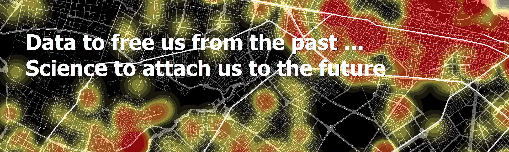

### Notas rápidas

``` library(bigrquery)
a0_base <- bq_table_download(bq_project_query(
"atlas-323415", # Proyececto
` ("SELECT  * FROM `atlas-323415.cooked_data.CT01_customer_total`"))) # Consulta `
```

#### medios
p <- p + stat_summary(fun.y = mean, geom = "point",
               shape = 20, size = 4, color = "turquoise")
               
    n_fun <- function(x){
      return(data.frame(y = mean(x)+0.22, label = paste0((
        round(mean(x, na.rm = T),1)))))
    }
#### et. medios
    p+ stat_summary(fun.data = n_fun, geom = "text", family = "serif",size =2.5)
